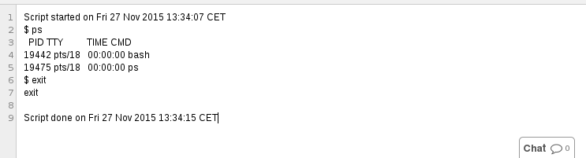

# SC-shell
Software Carpentry instructor shell. This program starts a command line terminal which logs output and uses an *engine* to push the content periodically to a back end (such as Etherpad).

## Install via PIP
To run shelter, you need to have Python installed.

Install shelter from pip as follows:
```
$ pip install git+git://github.com/c-martinez/sc-shell.git
```

## Configure

Create a configuration file with the following format:

```
[shelter]
apikey = <etherpad api key>
baseurl = http://<etherpad host url>/api
```

## Running

Run an etherpad exclusively dedicated for your terminal:

```
$ shelter <padID> [--config <configfile>] --dedicated
```
or an add a section to an existing etherpad
```
$ shelter <padID> [--config <configfile>] --section [--marker <marker>]
```

This will update the content of your Etherpad, for example:



## TODO's
 - Testing
 - Unit testing
 - Improve documentation
